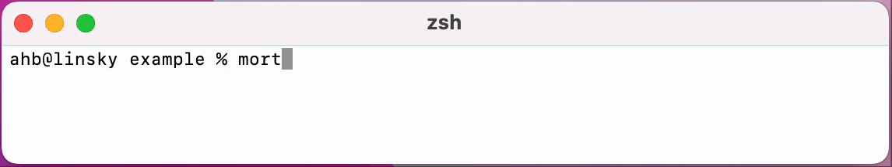

# mortimer
An interactive, structured timer for the command line

## WIP
This is a work in progress. No releases have been made yet.

## TODO
- Robust feedback when input differs from expected format
- Handle both tabs and spaces in indented sections
- Support keyboard input to pause, resume, finish a section
